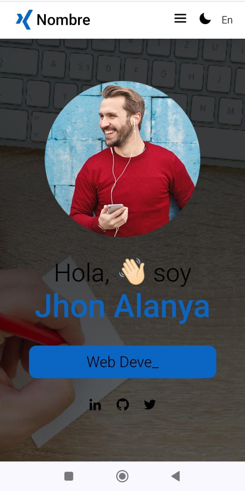

# Portafolio Personal

Este repositorio contiene el código fuente de mi portafolio personal, desarrollado con HTML, CSS y JavaScript. El propósito de este proyecto es presentar mi experiencia, habilidades y proyectos en un formato interactivo y atractivo para mostrar un modelo de portafolio.


[]

[]

()
()

## Características principales

- **Diseño Responsive:** El portafolio está diseñado para adaptarse a diferentes dispositivos y tamaños de pantalla, asegurando una experiencia óptima tanto en computadoras de escritorio como en dispositivos móviles.
  
- **Interactividad:** He implementado elementos interactivos y animaciones suaves para mejorar la experiencia del usuario y hacer que la navegación sea más atractiva.
  
- **Secciones Organizadas:** El portafolio está dividido en las siguientes secciones, proporcionando una estructura clara y fácil de seguir: 
    - Sobre mí 
    - Habilidades
    - Proyectos 
    - Contacto
    

- **Dark y Light Mode:** El portafolio cuenta con un modo oscuro y un modo claro, permitiendo a los usuarios elegir el tema que prefieran para la interfaz.

- **Tecnologías utilizadas:**
    -  HTML5 (Con estructura semántica y buenas practicas de accesibilidad)
   -  Bootstrap como framework para agilizar el desarrollo y garantizar una interfaz consistente y profesional
    -  CSS3 (con Flexbox y Grid para diseño responsivo)
    -  JavaScript (para añadir interactividad y animaciones)
   


## Ejecución Local

Para ejecutar este proyecto localmente, sigue estos pasos:

1. **Clona el repositorio:** Ejecuta el siguiente comando en tu terminal para clonar este repositorio en tu máquina local:
    ```sh
    git clone https://github.com/avja2019/portafolio-gen38.git
    ```

2. **Abre el proyecto:** Navega hasta la carpeta del proyecto clonado y abre el archivo `index.html` en tu navegador web.

3. **Explora:** ¡Explora el portafolio y familiarízate con mi trabajo y habilidades!

## Contribución

Si deseas contribuir a este proyecto, ¡eres bienvenido! Puedes abrir un *issue* para discutir nuevas características o problemas, o enviar un *pull request* con tus mejoras propuestas.

## Contacto

Si tienes alguna pregunta o sugerencia, no dudes en contactarme a través de [jhonantoni9.81@gmail.com](mailto:jhonantoni9.81@gmail.com).
